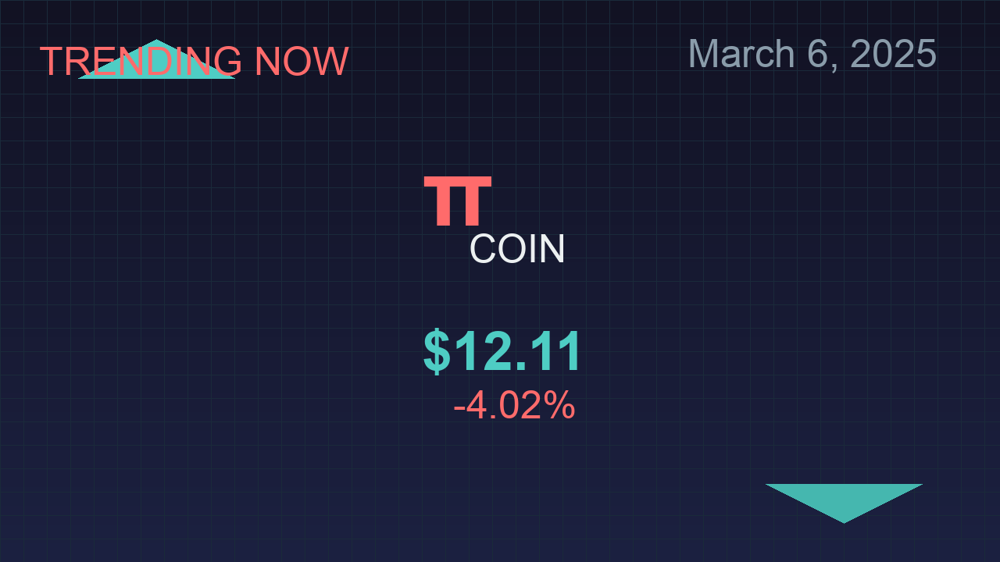

# Pi Coin Dashboard

A modern, interactive dashboard for Pi Coin built with Svelte and Tailwind CSS. This dashboard complements the Pi Coin assets generator that creates promotional materials for YouTube and social media.



## Features

- **Real-time Price Tracking**: View current Pi Coin price with 24-hour change percentage
- **Interactive Price Chart**: Visualize Pi Coin price trends over time
- **News Carousel**: Stay updated with the latest Pi Coin news
- **Recent Transactions**: Monitor recent market activity
- **Market Statistics**: View key metrics like market cap, volume, and supply

## Asset Generator Integration

This dashboard is part of a comprehensive Pi Coin promotional toolkit that includes an asset generator for:

- **YouTube Thumbnails** (1280x720)
- **YouTube Banners** (2048x1152)
- **Social Media Daily Updates** (1080x1080)

All assets feature modern design elements:
- Gradient backgrounds
- Tech-inspired grid patterns
- Dynamic pricing data
- Current date display (March 6, 2025)

## Technologies Used

- **Svelte**: For reactive UI components
- **Tailwind CSS**: For responsive styling
- **Chart.js**: For interactive price charts
- **Vite**: For fast development and optimized builds

## Development

```bash
# Install dependencies
npm install

# Start development server
npm run dev

# Build for production
npm run build
```

## Deployment

This project is configured for GitHub Pages deployment. Push to the main branch to trigger automatic deployment via GitHub Actions.

## License

MIT
